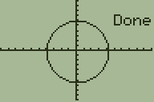
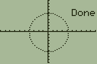

# Graphics Tutorial
Grammer offers much faster graphics over BASIC, but a good understanding of the
lower-level graphics is what will make your graphics *good*.

The most important graphics command is `DispGraph`, located at
`[prgm][right][4]`. In Grammer, graphics commands don't get rendered to the LCD
like they do in BASIC. Updating the LCD is a relatively slow operation on the TI-83+/84+ series of calculators (the physical LCD is much slower than the Z80 processor), so the ability to defer updating the LCD offers the biggest boost
in speed over BASIC graphics. This ability to defer is also what makes graphics
smoother.

#### DispGraph
By default, `DispGraph` draws the **graphscreen** to the LCD. Here is an example:
```
.0:Return
DispGraph
Stop
```
When you run this from the homescreen, you will see something like:

**

You can also display an arbitrary graphics buffer. If you aren't familiar with graphics buffers, see the section on [Graphics Buffers](../drawing.md#graphics-buffers).
```
.0:Return
DispGraph0
Stop
```
**

This shows garbage because `DispGraph` is reading the start of memory
(address 0) as if it is graphics data.

#### Disp
Most graphics routines allow you to provide an optional argument designating a
graphics buffer to draw to. You can also set a default buffer with the `Disp `
function. For example, `Disp G-T'` (or `Disp π9872` on older versions). Now,
whenever you draw or update the LCD, that is the buffer that will be used. This
means you can preserve the graph screen while still using graphics in Grammer.
Note that `G-T` is the token that you can see near the bottom of the mode menu.

As an example, let's set the secondary buffer as the default buffer and draw
some text. This will preserve the graphscreen, since we aren't drawing there!
```
.0:Return
Disp G-T`
Text(0,0,"HELLO, WORLD!
DispGraph
Stop
```
**

`Disp ` is also important if you want to use grayscale graphics. For the
following examples, I will assume you know the basic ideas behind grayscale on
these monochrome calculators. If not,
[brush up on grayscale](../drawing.md#grayscale).
Internally, Grammer cleverly sources data from two graphics buffers to determine
what to display to the LCD when using `DispGraph`. By default, "both" buffers
point to the graph screen, so it is always reading the same color pixel from
both sources, essentially displaying either black, or white, and never
flickering between the two. Also by default, Grammer sources 50% of the color from
one buffer, and 50% from the other.
Here is an example that draws grayscale bars until the user presses `[CLEAR]`:
```
.0:Return
Disp °G-T'        ;Set the secondary buffer to appBackUpScreen, 0x9872
ClrDraw           ;Clear the primary buffer
ClrDrawG-T'       ;Clear the back buffer
Line(0,0,64,48    ;Draws a black rectangle on the left half of the main buffer
Line(0,0,64,24,1,G-T'    ;Draws a black rectangle on the left quarter of the back buffer
Line(48,0,64,24,1,G-T'   ;Draws a black rectangle on the third quarter of the back buffer
Repeat getKey(15  ;Repeat the loop until key 15 ([clear]) is pressed
DispGraph         ;Display the graph buffers
End
Stop
```
**

You can change how much color is sourced from each buffer by selecting a
different gray mask. Internally, Grammer has 12 different masks, but
realistically only masks 1 and 2 are the most useful. Mask 1 is the default and
sources 50% from each buffer. However Mask 2 sources 67% from the primary buffer
and 33% from the back buffer, allowing 4 different shades.
Adding `2→Disp` to the start of the above code:
```
.0:Return
2→Disp            ;Set to 67-33 grayscale mode
Disp °G-T'        ;Set the secondary buffer to appBackUpScreen, 0x9872
ClrDraw           ;Clear the primary buffer
ClrDrawG-T'       ;Clear the back buffer
Line(0,0,64,48    ;Draws a black rectangle on the left half of the main buffer
Line(0,0,64,24,1,G-T'    ;Draws a black rectangle on the left quarter of the back buffer
Line(48,0,64,24,1,G-T'   ;Draws a black rectangle on the third quarter of the back buffer
Repeat getKey(15  ;Repeat the loop until key 15 ([clear]) is pressed
DispGraph         ;Display the graph buffers
End
Stop
```
**


#### ClrDraw
`ClrDraw` clears the primary graphics buffer, setting it to white, and resets
the text coordinates to the upper-left, (0,0). Alternatively, you can specify a
graphics buffer to erase, for example: `ClrDrawG-T'` would clear the buffer that
`G-T'` points to (typically used as a back buffer for grayscale).

#### Text(
There are many different methods for drawing text in Grammer.
By default, it uses a 4x6 fixed-width font, and can draw to 24 columns (much
like the TI-BASIC `Output(` command drawing to only 16 columns on the
homescreen). Unlike TI-BASIC, `Output(` is instead used to change font settings.
This lets you choose between grid-aligned and pixel-aligned drawing, or the
small, fixed-width font, or the large variable-width font, or even custom fonts
from Batlib and Omnicalc. You can find more on this in the [Output(](#output)
section.

###### Draw text strings:
The most basic way to use `Text(` looks a lot like BASIC:
```
.0:Return
ClrDraw
Text(3,1,"HELLO, WORLD
DispGraph
Stop
```
This draws the text, `"HELLO, WORLD"` at three pixels down and 1 column
(4 pixels) to the right.

**

You can also specify how many chars to print, with an  optional fourth argument.
*Note: this will draw end-of-string characters instead of stopping early!*
For example:
```
.0:Return
ClrDraw
Text(4,1,"TOMATO",3
DispGraph
Stop
```
**

Or a little more exciting:
```
.0:Return
ClrDraw
Text(4,1,"HELLO",17
DispGraph
Stop
```
**


###### Draw numbers:
To draw a number, use the `'` modifier:
```
.0:Return
ClrDraw
Text('0,0,1337
DispGraph
Stop
```
This draws the number 1337 in the upper-left corner of the screen.

**

When drawing numbers, you can add an optional argument to change what base to
draw the number in. For example, binary is base 2, so:
```
.0:Return
ClrDraw
Text('0,0,1337,2
DispGraph
Stop
```
**

Grammer uses "16-bit unsigned integers",  but sometimes you'll want to draw
"signed" numbers. If you don't know what these mean, check out the section on
[Number Systems](../math.md#number-systems).

To draw numbers as signed values, set the mode flag with `Fix or 32` (see
[Fix Modes](../readme.md#Modes) for more). Here is an example where we display
the value of `3-4`, which is `-1`. On the left, we omit the `Fix or 32`,
so it displays as 65536-1=65535. On the right, we display it as signed, so it
shows as `-1`

```
.0:Return
Fix or 32
ClrDraw
Text('0,0,3-4
DispGraph
Stop
```
**
**

Grammer also allows you to draw a 32-bit number stored in two pointer vars.
An example where B is the upper 16-bits and C' is the lower 16-bits:
`:Text('0,0,BC'`
Or a more practical example, we can display a number including the overflow of
multiplication. We'll make use of the 32-bit store described in the
[Basic Operations](../readme.md#basic-operations) section:
```
.0:Return
ClrDraw
39103*136→AB
Text('0,0,AB
DispGraph
Stop
```
**


###### Follow text with more text
If you want to draw text where the last `Text(` command left off, use a degree
token to replace coordinates: `Text(°`. For example, we'll
display the numbers 3 and 4 with a comma separating them:
```
.0:Return
ClrDraw
Text('0,0,3
Text(°",
Text('°4
DispGraph
Stop
```
**

Note that `°` came *after* `'` when we wanted to display the `4`. This is because
the modifier `'` comes before the coordinates when displaying numbers, and `°`
replaces the coordinates.

###### Typewriter text
"Typewriter text" is text displayed with a small pause between characters drawn.
To use this effect, you can use `/Text(` or `Text(`<sup>`r`</sup> (that is the
superscript `r` found at [2nd][APPS]). You can change the delay with `Fix Text(`
(see [Fix Modes](../readme.md#Modes) for more). *Note: Typewriter text
automatically updates the LCD.*
```
.0:Return
ClrDraw
/Text(0,0,"HELLO, WORLD!
Stop
```
**

Typewriter text works with all of the text modes, not just strings!

###### Display Text Characters (ASCII, ish)
There are 256 characters in the font, some are more difficult to access via the
OS tokens. In Grammer, you can directly draw chars by number if you put a `'`
before the last argument. For example, 37 corresponds to the `%` char:

```
.0:Return
ClrDraw
Text(4,1,'37
DispGraph
Stop
```
**

Note that if we want to draw a char to the last text coordinates, we put the `'`
*after* the `°`:
```
.0:Return
ClrDraw
Text('4,1,100
Text(°'37
DispGraph
Stop
```
**

###### Display text as ASCII, not tokens
Drawing ASCII is **not** intended for drawing text that you type in the program
editor! If you don't know what a "null terminated string" is, then you probably
don't want to use this! After this sentence, I will get technical and you should
probably know Assembly or C to understand it.

In the event that you have an ASCII string that you would like to display, keep
in mind that it must be null-terminated (ends in a 0x00). Display with the
syntax, `Text(Y,X,°<<pointer>>`.


###### Miscellaneous Text Operations
If you want to draw to coordinates relative to the last drawn coordinates, you
can do something like this: `Text(+3,+0,"Hello`. But instead of +0, just leave
it empty like this: `Text(+3,,"Hello`

Using the `Text(` command with no arguments returns the Y position
in `Ans` and the X position in `Ɵ'`.

You can set the coordinates without drawing text, too: `Text(0,0`.

#### Circle(
The syntax is `Circle(Y,X,R[,Method[,pattern[,buffer`.
This draws a circle using Y and X as pixel coordinates and R as the radius of the circle in pixels. `Method` is how to draw the circle:
* 1 - Black border (Default)
* 2 - White border
* 3 - Inverted border
* 4 - White border, white fill
* 5 - Black border, black fill
* 6 - Invert border, invert fill
* 7 - White border, black fill
* 8 - White border, invert fill
* 9 - Black border, white fill
* 10 - Black border, invert fill
* 11 - Invert border, white fill
* 12 - Invert border, black fill


`Pattern` is a number from 0 to 255 that will be used as a drawing pattern for the border. For example, 85 is `01010101` in binary, so every other pixel will not be drawn. Use 0 for no pattern. If the bit is 0, the pixel will be drawn, if it is 1, it won't be drawn. `Buffer` is the buffer to draw to (useful with grayscale).

For basic usage:
```
.0:Return
Circle(32,48,20
DispGraph
Stop
```
**

Or an example using a pattern, we need to include the method argument.
```
.0:Return
Circle(32,48,20,1,85
DispGraph
Stop
```
**
