# Table of Contents

<!-- MDTOC maxdepth:6 firsth1:1 numbering:0 flatten:0 bullets:1 updateOnSave:1 -->

- [Table of Contents](#table-of-contents)   
- [Graphics Tutorial](#graphics-tutorial)   
   - [DispGraph](#dispgraph)   
   - [Disp](#disp)   
   - [ClrDraw](#clrdraw)   
   - [ClrHome](#clrhome)   
   - [Shade(](#shade)   
   - [Text(](#text)   
      - [Draw text strings](#draw-text-strings)   
      - [Draw numbers](#draw-numbers)   
      - [Follow text with more text](#follow-text-with-more-text)   
      - [Typewriter text](#typewriter-text)   
      - [Display Text Characters (ASCII, ish)](#display-text-characters-ascii-ish)   
      - [Display text as ASCII, not tokens](#display-text-as-ascii-not-tokens)   
      - [Miscellaneous Text Operations](#miscellaneous-text-operations)   
   - [Pxl-On(](#pxl-on)   
   - [Pxl-Off(](#pxl-off)   
   - [Pxl-Change(](#pxl-change)   
      - [Langton's Ant Example](#langtons-ant-example)   
   - [Pxl-Test(](#pxl-test)   
   - [Horizontal](#horizontal)   
   - [Vertical](#vertical)   
   - [Tangent(](#tangent)   
   - [Fill(](#fill)   
   - [RecallPic](#recallpic)   
   - [StorePic](#storepic)   
   - [Pt-Off(](#pt-off)   
   - [Pt-On(](#pt-on)   
   - [Line(](#line)   
   - [Line('](#line)   
   - [Pt-Change(](#pt-change)   

<!-- /MDTOC -->

# Graphics Tutorial
Grammer offers much faster graphics over BASIC, but a good understanding of the
lower-level graphics is what will make your graphics *good*.

The most important graphics command is `DispGraph`, located at
`[prgm][right][4]`. In Grammer, graphics commands don't get rendered to the LCD
like they do in BASIC. Updating the LCD is a relatively slow operation on the TI-83+/84+ series of calculators (the physical LCD is much slower than the Z80 processor), so the ability to defer updating the LCD offers the biggest boost
in speed over BASIC graphics. This ability to defer is also what makes graphics
smoother.

## DispGraph
By default, `DispGraph` draws the **graphscreen** to the LCD. Here is an example:
```
.0:Return
DispGraph
Stop
```
When you run this from the homescreen, you will see something like:

*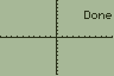*

You can also display an arbitrary graphics buffer. If you aren't familiar with graphics buffers, see the section on [Graphics Buffers](../drawing.md#graphics-buffers).
```
.0:Return
DispGraph0
Stop
```
*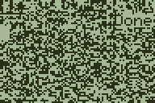*

This shows garbage because `DispGraph` is reading the start of memory
(address 0) as if it is graphics data.

## Disp
Most graphics routines allow you to provide an optional argument designating a
graphics buffer to draw to. You can also set a default buffer with the `Disp `
function. For example, `Disp G-T'` (or `Disp π9872` on older versions). Now,
whenever you draw or update the LCD, that is the buffer that will be used. This
means you can preserve the graph screen while still using graphics in Grammer.
Note that `G-T` is the token that you can see near the bottom of the mode menu.

As an example, let's set the secondary buffer as the default buffer and draw
some text. This will preserve the graphscreen, since we aren't drawing there!
```
.0:Return
Disp G-T`
Text(0,0,"HELLO, WORLD!
DispGraph
Stop
```
**

`Disp ` is also important if you want to use grayscale graphics. For the
following examples, I will assume you know the basic ideas behind grayscale on
these monochrome calculators. If not,
[brush up on grayscale](../drawing.md#grayscale).
Internally, Grammer cleverly sources data from two graphics buffers to determine
what to display to the LCD when using `DispGraph`. By default, "both" buffers
point to the graph screen, so it is always reading the same color pixel from
both sources, essentially displaying either black, or white, and never
flickering between the two. Also by default, Grammer sources 50% of the color from
one buffer, and 50% from the other.
Here is an example that draws grayscale bars until the user presses `[CLEAR]`:
```
.0:Return
Disp °G-T'        ;Set the secondary buffer to appBackUpScreen, 0x9872
ClrDraw           ;Clear the primary buffer
ClrDrawG-T'       ;Clear the back buffer
Line(0,0,64,48    ;Draws a black rectangle on the left half of the main buffer
Line(0,0,64,24,1,G-T'    ;Draws a black rectangle on the left quarter of the back buffer
Line(48,0,64,24,1,G-T'   ;Draws a black rectangle on the third quarter of the back buffer
Repeat getKey(15  ;Repeat the loop until key 15 ([clear]) is pressed
DispGraph         ;Display the graph buffers
End
Stop
```
**

You can change how much color is sourced from each buffer by selecting a
different gray mask. Internally, Grammer has 12 different masks, but
realistically only masks 1 and 2 are the most useful. Mask 1 is the default and
sources 50% from each buffer. However Mask 2 sources 67% from the primary buffer
and 33% from the back buffer, allowing 4 different shades.
Adding `2→Disp` to the start of the above code:
```
.0:Return
2→Disp            ;Set to 67-33 grayscale mode
Disp °G-T'        ;Set the secondary buffer to appBackUpScreen, 0x9872
ClrDraw           ;Clear the primary buffer
ClrDrawG-T'       ;Clear the back buffer
Line(0,0,64,48    ;Draws a black rectangle on the left half of the main buffer
Line(0,0,64,24,1,G-T'    ;Draws a black rectangle on the left quarter of the back buffer
Line(48,0,64,24,1,G-T'   ;Draws a black rectangle on the third quarter of the back buffer
Repeat getKey(15  ;Repeat the loop until key 15 ([clear]) is pressed
DispGraph         ;Display the graph buffers
End
Stop
```
*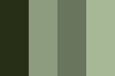*


## ClrDraw
`ClrDraw` clears the primary graphics buffer, setting it to white, and resets
the text coordinates to the upper-left, (0,0). Alternatively, you can specify a
graphics buffer to erase, for example: `ClrDrawG-T'` would clear the buffer that
`G-T'` points to (typically used as a back buffer for grayscale).

## ClrHome
This clears the home screen buffer and resets the cursor coordinates. This isn't
really useful in Grammer as the homescreen is essentially unused, but it's good
for aesthetics and advanced users users.

## Shade(
This sets the contrast to a value from 0 to 39. 24 is normal. An example is
`Shade(30`.

*Note: I am aware that the LCD actually offers 64 different shades, however, I
deferred to the OS conventions. Why I did this is beyond me, but it's too late
to change it.*

## Text(
There are many different methods for drawing text in Grammer.
By default, it uses a 4x6 fixed-width font, and can draw to 24 columns (much
like the TI-BASIC `Output(` command drawing to only 16 columns on the
homescreen). Unlike TI-BASIC, `Output(` is instead used to change font settings.
This lets you choose between grid-aligned and pixel-aligned drawing, or the
small, fixed-width font, or the large variable-width font, or even custom fonts
from Batlib and Omnicalc. You can find more on this in the [Output(](#output)
section.

### Draw text strings
The most basic way to use `Text(` looks a lot like BASIC:
```
.0:Return
ClrDraw
Text(3,1,"HELLO, WORLD
DispGraph
Stop
```
This draws the text, `"HELLO, WORLD"` at three pixels down and 1 column
(4 pixels) to the right.

*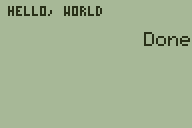*

You can also specify how many chars to print, with an  optional fourth argument.
*Note: this will draw end-of-string characters instead of stopping early!*
For example:
```
.0:Return
ClrDraw
Text(4,1,"TOMATO",3
DispGraph
Stop
```
*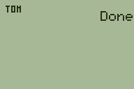*

Or a little more exciting:
```
.0:Return
ClrDraw
Text(4,1,"HELLO",17
DispGraph
Stop
```
*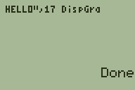*


### Draw numbers
To draw a number, use the `'` modifier:
```
.0:Return
ClrDraw
Text('0,0,1337
DispGraph
Stop
```
This draws the number 1337 in the upper-left corner of the screen.

*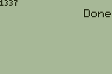*

When drawing numbers, you can add an optional argument to change what base to
draw the number in. For example, binary is base 2, so:
```
.0:Return
ClrDraw
Text('0,0,1337,2
DispGraph
Stop
```
*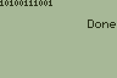*

Grammer uses "16-bit unsigned integers",  but sometimes you'll want to draw
"signed" numbers. If you don't know what these mean, check out the section on
[Number Systems](../math.md#number-systems).

To draw numbers as signed values, set the mode flag with `Fix or 32` (see
[Fix Modes](../readme.md#Modes) for more). Here is an example where we display
the value of `3-4`, which is `-1`. On the left, we omit the `Fix or 32`,
so it displays as 65536-1=65535. On the right, we display it as signed, so it
shows as `-1`

```
.0:Return
Fix or 32
ClrDraw
Text('0,0,3-4
DispGraph
Stop
```
*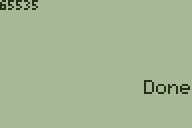*
*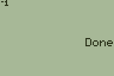*

Grammer also allows you to draw a 32-bit number stored in two pointer vars.
An example where B is the upper 16-bits and C' is the lower 16-bits:
`:Text('0,0,BC'`
Or a more practical example, we can display a number including the overflow of
multiplication. We'll make use of the 32-bit store described in the
[Basic Operations](../readme.md#basic-operations) section:
```
.0:Return
ClrDraw
39103*136→AB
Text('0,0,AB
DispGraph
Stop
```
*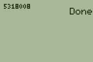*


### Follow text with more text
If you want to draw text where the last `Text(` command left off, use a degree
token to replace coordinates: `Text(°`. For example, we'll
display the numbers 3 and 4 with a comma separating them:
```
.0:Return
ClrDraw
Text('0,0,3
Text(°",
Text('°4
DispGraph
Stop
```
*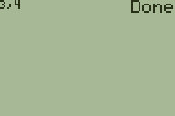*

Note that `°` came *after* `'` when we wanted to display the `4`. This is because
the modifier `'` comes before the coordinates when displaying numbers, and `°`
replaces the coordinates.

### Typewriter text
"Typewriter text" is text displayed with a small pause between characters drawn.
To use this effect, you can use `/Text(` or `Text(`<sup>`r`</sup> (that is the
superscript `r` found at [2nd][APPS]). You can change the delay with `Fix Text(`
(see [Fix Modes](../readme.md#Modes) for more). *Note: Typewriter text
automatically updates the LCD.*
```
.0:Return
ClrDraw
/Text(0,0,"HELLO, WORLD!
Stop
```
**

Typewriter text works with all of the text modes, not just strings!

### Display Text Characters (ASCII, ish)
There are 256 characters in the font, some are more difficult to access via the
OS tokens. In Grammer, you can directly draw chars by number if you put a `'`
before the last argument. For example, 37 corresponds to the `%` char:

```
.0:Return
ClrDraw
Text(4,1,'37
DispGraph
Stop
```
*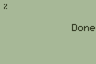*

Note that if we want to draw a char to the last text coordinates, we put the `'`
*after* the `°`:
```
.0:Return
ClrDraw
Text('4,1,100
Text(°'37
DispGraph
Stop
```
*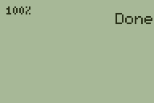*

### Display text as ASCII, not tokens
Drawing ASCII is **not** intended for drawing text that you type in the program
editor! If you don't know what a "null terminated string" is, then you probably
don't want to use this! After this sentence, I will get technical and you should
probably know Assembly or C to understand it.

In the event that you have an ASCII string that you would like to display, keep
in mind that it must be null-terminated (ends in a 0x00). Display with the
syntax, `Text(Y,X,°<<pointer>>`.


### Miscellaneous Text Operations
If you want to draw to coordinates relative to the last drawn coordinates, you
can do something like this: `Text(+3,+0,"Hello`. But instead of +0, just leave
it empty like this: `Text(+3,,"Hello`

Using the `Text(` command with no arguments returns the Y position
in `Ans` and the X position in `Ɵ'`.

You can set the coordinates without drawing text, too: `Text(0,0`.

## Pxl-On(
The arguments for this are: `Pxl-On(y,x[,buf`.
This draws a black pixel at coordinates (`y`,`x`), on buffer `buf`. If you omit
the `buf` argument, this defaults to the current default buffer. As well, the
previous pixel value is returned, with 0 indicating white, and 1 indicating
black.

To set the upper-left pixel black, we can do:
```
Pxl-On(0,0
```

To set the bottom-right pixel black:
```
Pxl-On(63,95
```

## Pxl-Off(
The arguments for this are: `Pxl-Off(y,x[,buf`.
This draws a white pixel at coordinates (`y`,`x`), on buffer `buf`. If you omit
the `buf` argument, this defaults to the current default buffer. As well, the
previous pixel value is returned, with 0 indicating white, and 1 indicating
black.

To set the upper-left pixel white, we can do:
```
Pxl-Off(0,0
```

To set the bottom-right pixel white:
```
Pxl-Off(63,95
```


## Pxl-Change(
The arguments for this are: `Pxl-Change(y,x[,buf`.
This toggles a pixel at coordinates (`y`,`x`), on buffer `buf`. If you omit
the `buf` argument, this defaults to the current default buffer. As well, the
previous pixel value is returned, with 0 indicating white, and 1 indicating
black.

To toggle the upper-left pixel:
```
Pxl-Change(0,0
```

To toggle the bottom-right pixel:
```
Pxl-Change(63,95
```

### Langton's Ant Example
An interesting application of Grammer's `Pxl-Change(` command is with
[Langton's Ant](https://en.wikipedia.org/wiki/Langton%27s_ant). Because a pixel
test is built in, we can combine the test+toggle step. Here is an example that
displays every 250 iterations, but only exits when you press `[Clear]`.

```
:.0:Return
:Full
:ClrDraw
:0→D→C
:32→Y:48→X
:Repeat getKey(15
:Pxl-Change(Y,X
:+Ans+D-1
: and 3→D
:Y+D=0:-D=2→Y
:X+D=3:-D=1→X
:C+1→C
:If !C and 255
:DispGraph
:End
;Stop
```
***Note:*** *the `and 3` and `and 255` tricks only works for powers of 2! `3` is
2^2-1 and `255` is 2^8-1.*

*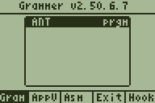*

## Pxl-Test(
The arguments for this are: `Pxl-Test(y,x[,buf`.
This gets the pixel value at coordinates (`y`,`x`), on buffer `buf`. If you omit
the `buf` argument, this defaults to the current default buffer. Returns 0 if
the pixel is off (white), and 1 if the pixel is on (black).

## Horizontal
This draws a horizontal line on the graph. The syntax is
`Horizontal y[,method,[,Buffer`
* `y` is a value from 0 to 63
* `method` is how to draw the line:
  * 0 = draws a white line
  * 1 = draws a black line (*Default*)
  * 2 = draws an inverted line
* `Buffer` is the buffer to draw to.

For example, this will make a screen-wiping animation from the up and down
directions:
```
:.0:Return
:For(K,0,31
:Horizontal K
:Horizontal 63-K
:DispGraph
:End
:Stop
```

*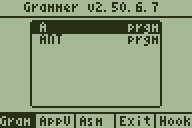*


## Vertical
This draws a vertical line on the graph. The syntax is:
`Vertical x[,method[,Buffer`
* `x` is a value from 0 to 63
* `method` is how to draw the line:
  * 0 = draws a white line
  * 1 = draws a black line (*Default*)
  * 2 = draws an inverted line
* `Buffer` is the buffer to draw to.

For example, this will make a screen-wiping animation from the left and right
directions:
```
:.0:Return
:For(K,0,47
:Vertical K
:Vertical 95-K
:DispGraph
:End
:Stop
```

**

## Tangent(
This is used to shift the screen a number of pixels. The syntax is:
Tangent(#ofShifts,Direction[,Buffer
`#ofShifts` is the number of pixels to shift the graph screen
`Direction` is represented as a number:
* 1 = Down
* 2 = Right
* 4 = Left
* 8 = Up
You can combine directions by adding the values. For example,
Right and Up would be 10 because 2+8=10, so to shift the buffer contents right
and up 4 pixels:

```
Tangent(4,10
```

<!--


## Fill(
  Stick around, this is a pretty full command list.
* 0-Black
  * This fills the screen buffer with black pixels
* 1-Invert
  * This inverts the screen buffer
* 2-Checker1
  * This fills the screen buffer with a checkered pattern
* 3-Checker2
  * This fills the screen buffer with another checkered pattern
* 4,x-LoadBytePatternOR
  * copies a byte to every byte of the buffer data with OR logic
* 5,x-LoadBytePatternXOR
  * copies a byte to every byte of the buffer data with XOR logic
* 6,x-LoadBytePatternAND
  * copies a byte to every byte of the buffer data with AND logic
* 7,x-LoadBytePatternErase
  * copies a byte to every byte of the buffer data with Erase logic
* 8,x-BufCopy
  * x points to another buffer. The current buffer gets copied there
* 9,x-BufOR
  * x points to another buffer. This gets copied to the current buffer with OR logic.
* 10,x-BufAND
  * x points to another buffer. This gets copied to the current buffer with AND logic.
* 11,x-BufXOR
  * x points to another buffer. This gets copied to the current buffer with XOR logic.
* 12,x-BufErase
  * x points to another buffer. This gets copied to the current buffer by erasing.
* 13,x-BufSwap
  * x points to a buffer. This swaps the current buffer with the other.
* 14,x-CopyDownOR
  * The current buffer is copied x pixels down to itself with OR logic
* 15,x-CopyDownAND
  * The current buffer is copied x pixels down to itself with AND logic
* 16,x-CopyDownXOR
  * The current buffer is copied x pixels down to itself with XOR logic
* 17,x-CopyDownErase
  * The current buffer is copied x pixels down to itself with Erase logic
* 18,x-CopyUpOR
  * The current buffer is copied x pixels up to itself with OR logic
* 19,x-CopyUpAND
  * The current buffer is copied x pixels up to itself with AND logic
* 20,x-CopyUpXOR
  * The current buffer is copied x pixels up to itself with XOR logic
* 21,x-CopyUpErase
  * The current buffer is copied x pixels up to itself with Erase logic
* 22,type-FireCycle
  * This burns the contents of the screen for one cycle. If type is 0, white fire is used, if it is 1, black fire is used.
* 23,Type,Y,X,Width,Height-Fire Cycle 2
  * Type is the same as FireCycle and the other inputs are the same as Pt-On( where X and Width go by every 8 pixels.


## RecallPic
This is used to copy a picture to the current buffer. As an example of its use `RecallPic 0`. This works for pictures 0 to 255 and archived pics.

## StorePic
This stores the contents of the current buffer to a picture. This automatically deletes a preexisting picture. You can use this to store to pictures 0 to 255.

## Pt-Off(
This is used to draw sprites to pixel coordinates. It is limited in some ways, compared to the Pt-On( command, but more flexible in others. The syntax is: `Pt-Off(Method,DataPointer,Y,X,[Width,[Height[,Buffer`

* Method is how the sprite is drawn:
  * 0-Overwrite
    * This overwrites the graph screen data this is drawn to.
  * 1-AND
    * This draws the sprite with AND logic
  * 2-XOR
    * This draws the sprite with XOR logic
  * 3-OR
    * This draws the sprite with OR logic
  * 5-Erase
    * Where there are normally pixels on for the sprite, this
  draws them as pixels off.
  *By adding 8 to the Method, the data will be read as hexadecimal

* DataPointer is a pointer to the sprite data
* Y is the pixel Y-coordinate
* X is the pixel X-coordinate
* Width is the width of the sprite (in bytes). The default is 1 (8 pixels).
* Height is the number of pixels tall the sprite is. 8 is default

## Pt-On(
This also draws sprites, but only to 12 columns (every 8 pixels).
This is slightly faster than `Pt-Off(` and has the advantage of
variable width. It also has the DataSwap option that isn't present
with the `Pt-Off(` command. Here is the syntax of the command:
`Pt-On(Method,DataPointer,Y,X,[Width,[Height[,Buffer`

* Method-This is how the sprite is drawn:
  * 0-Overwrite
  * 1-AND
  * 2-XOR
  * 3-OR
  * 4-DataSwap
    * This swaps the data on the graph screen with the sprite data. Doing this twice results in no change.
  * 5-Erase
  * 6-Mask
    * This will display a masked sprite.
  * 7-Gray
    * This draws a frame of a 3 level gray sprite
  *By adding 8 to the Method, the data will be read as hexadecimal
* DataPointer is a pointer to the sprite data
* Y is the pixel Y-coordinate
* X is a value from 0 to 11.
* Width is how wide the sprite is. 1=8 pixels, 2=16 pixels,.... Default is 1.
* Height is the number of pixels tall the sprite is. Default is 8.

## Line(
This is used to draw rectangles. The syntax for this command is:
`Line(x,y,Height,Width,Method`

* x is a value from 0 to 95 and is the x pixel coordinate to begin drawing at
* y is a value from 0 to 63 and is the y pixel coordinate to begin drawing at
* Height is a value from 1 to 64 is the number of pixels tall the box will be
* Width is a value from 1 to 96 is the number of pixels tall the box will be
* Method is what kind of fill you want:
  * 0-White. This turns off all of the pixels of the rectangle
  * 1-Black. This turns on all of the pixels of the rectangle
  * 2-Invert. This inverts all of the pixels of the rectangle
  * 3-Black border. Draws a black perimeter not changing the inside
  * 4-White border. Draws a white perimeter not changing the inside
  * 5-Inverted border. Draws an inverted perimeter not changing the inside
  * 6-Black border, White inside.
  * 7-Black border, Inverted inside.
  * 8-White border, Black inside.
  * 9-White border, Inverted inside.
  * 10-Shifts the contents in that rectangle up
  * 11-Shifts the contents in that rectangle down
  * 12-
  * 13-
  * 14-Pxl-Test Rect (count the number of ON pixels in the rectangle)
  * 15-Pxl-Test Border (count the number of ON pixels on the border)
  * 16-Inverted border, black fill
  * 17-Inverted border, white fill

## Line('
This is used to draw lines. The syntax for this command is `Line('x1,y1,x2,y2[,Method[,Buffer`
So it is two sets of pixel coordinates and then the Method:
* 0=White
* 1=Black
* 2=Invert

If Method is omitted, it uses `1` as the default.

* Buffer is the buffer to draw to.

## Pt-Change(
This command is used to draw tilemaps. There is currently one
method, but more should be added in the future. Here is the
syntax:
`Pt-Change(0,MapData,TileData,MapWidth,MapXOffset,MapYOffset,TileMethod`
* MapData is a pointer to the map data
* TileData is a pointer to the tile set
* MapWidth is the width of the map (at least 12)
* MapXOffset is the X offset into the map data
* MapYOffset is the Y offset into the map data
* TileMethod is how the sprite will be drawn (see Pt-On()

Please note that the tile data and map data have to be raw bytes, as opposed to hexadecimal. There are some tools written in Grammer for creating sprite sets and tilemaps on TICalc or Omnimaga.


-->
